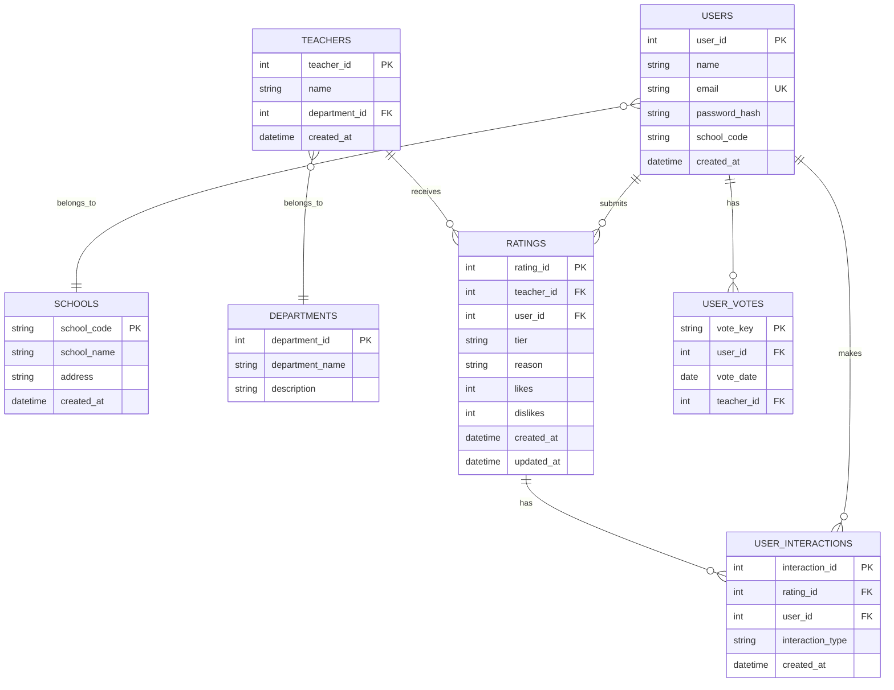

# Rate My Teacher - ER 图

## Mermaid ER 图

## 实体详细说明

### 1. USERS (用户表)
- **user_id** (PK): 用户唯一标识
- **name**: 用户姓名
- **email** (UK): 邮箱地址（唯一）
- **password_hash**: 密码哈希值
- **school_code**: 学校代码（外键关联 SCHOOLS）
- **created_at**: 注册时间

### 2. SCHOOLS (学校表)
- **school_code** (PK): 学校代码（主键）
- **school_name**: 学校名称
- **address**: 学校地址
- **created_at**: 创建时间

### 3. TEACHERS (老师表)
- **teacher_id** (PK): 老师唯一标识
- **name**: 老师姓名
- **department_id** (FK): 所属部门ID（外键关联 DEPARTMENTS）
- **created_at**: 创建时间

### 4. DEPARTMENTS (部门表)
- **department_id** (PK): 部门唯一标识
- **department_name**: 部门名称（如：计算机科学系、数学系）
- **description**: 部门描述

### 5. RATINGS (评分表)
- **rating_id** (PK): 评分唯一标识
- **teacher_id** (FK): 被评分的老师ID（外键关联 TEACHERS）
- **user_id** (FK): 评分用户ID（外键关联 USERS）
- **tier**: 评分等级（T1=5分, T2=10分, T3=15分）
- **reason**: 评分理由（10-50字）
- **likes**: 点赞数
- **dislikes**: 点踩数
- **created_at**: 评分创建时间
- **updated_at**: 评分更新时间

### 6. USER_VOTES (用户投票记录表)
- **vote_key** (PK): 复合主键（user_id + vote_date + teacher_id）
- **user_id** (FK): 用户ID（外键关联 USERS）
- **vote_date**: 投票日期
- **teacher_id** (FK): 被评分的老师ID（外键关联 TEACHERS）

**业务规则**：
- 每个用户每天最多为2位老师评分
- 每个用户每天对同一老师只能评分一次

### 7. USER_INTERACTIONS (用户互动记录表)
- **interaction_id** (PK): 互动记录唯一标识
- **rating_id** (FK): 被互动的评分ID（外键关联 RATINGS）
- **user_id** (FK): 互动用户ID（外键关联 USERS）
- **interaction_type**: 互动类型（'like' 或 'dislike'）
- **created_at**: 互动时间

**业务规则**：
- 每个用户对每个评分只能点赞或点踩一次
- 可以取消点赞/点踩

## 关系说明

1. **USERS → RATINGS** (1:N)
   - 一个用户可以对多个老师进行评分
   - 每个评分必须关联一个用户

2. **TEACHERS → RATINGS** (1:N)
   - 一个老师可以收到多个评分
   - 每个评分必须关联一个老师

3. **USERS → SCHOOLS** (N:1)
   - 多个用户属于同一所学校
   - 每个用户必须关联一所学校

4. **TEACHERS → DEPARTMENTS** (N:1)
   - 多个老师属于同一部门
   - 每个老师必须关联一个部门

5. **RATINGS → USER_INTERACTIONS** (1:N)
   - 一个评分可以收到多个互动（点赞/点踩）
   - 每个互动必须关联一个评分

6. **USERS → USER_VOTES** (1:N)
   - 一个用户有多条投票记录
   - 用于限制每日评分次数

7. **USERS → USER_INTERACTIONS** (1:N)
   - 一个用户可以进行多次互动
   - 记录用户对评分的点赞/点踩行为

## 约束条件

### 数据完整性约束
- **主键约束**: 所有表都有唯一主键
- **外键约束**: 所有外键必须引用有效的主键
- **唯一约束**: 
  - USERS.email 必须唯一
  - USER_VOTES 中 (user_id, vote_date, teacher_id) 组合必须唯一
  - USER_INTERACTIONS 中 (user_id, rating_id) 组合必须唯一

### 业务规则约束
- **评分理由长度**: 10-50字
- **Tier等级**: 只能是 'T1', 'T2', 'T3' 之一
- **每日评分限制**: 每个用户每天最多为2位老师评分
- **评分时间范围**: 支持当天、当月、当学期、当学年、历史总排名筛选

### 评分规则
- **T1**: 5分
- **T2**: 10分
- **T3**: 15分
- 总分 = Σ(每个评分的tier对应分数)
- 排名按总分降序，总分相同按评分数量降序

## 索引建议

1. **USERS表**:
   - 主键索引: user_id
   - 唯一索引: email
   - 索引: school_code

2. **RATINGS表**:
   - 主键索引: rating_id
   - 索引: teacher_id
   - 索引: user_id
   - 复合索引: (teacher_id, created_at)
   - 索引: created_at

3. **USER_VOTES表**:
   - 复合主键索引: (user_id, vote_date, teacher_id)
   - 索引: user_id
   - 索引: vote_date

4. **USER_INTERACTIONS表**:
   - 主键索引: interaction_id
   - 复合唯一索引: (user_id, rating_id)
   - 索引: rating_id

